Transcriptional heterogeneity in myeloid progenitors
----------------------------------------------------

This tutorial describes how to apply CellRouter to a mouse single-cell
RNA-sequencing dataset generated by Paul et al. (Cell, 2015). In your
working directory, pelase create a folder named "results". Then, inside
the folder results, create a folder named "paths".

Make sure you load the CellRouter class properly by doing:
----------------------------------------------------------

    source('path/to/cellrouter/class/CellRouter_Class.R')

Load metadata, Create a CellRouter object and add metadata information to it. The function addInfo can used to include metadata information in the CellRouter metadata table (<cellrouter@sampTab>). If you have clusters identified by other algorithm, you can use this function to perform all the analysis available in CellRouter using your previously identified clusters: just select the corresponding columns in the table <cellrouter@sampTab>.
----------------------------------------------------------------------------------------------------------------------------------------------------------------------------------------------------------------------------------------------------------------------------------------------------------------------------------------------------------------------------------------------------------------------------------------------------------

    library('dplyr')
    samples <- get(load('Paul_Cell_samples.R'))
    cellrouter <- CellRouter(path='Paul_Cell_data.R', min.cells=3, min.genes=0)

    ## [1] "Initializing CellRouter object"

    cellrouter <- addInfo(cellrouter, metadata = samples, colname = 'celltype', metadata.column='cell_type')
    cellrouter <- addInfo(cellrouter, metadata = samples, colname = 'celltype2', metadata.column='cell_type2')

    ## Example regarding how to filter out cells based on a list of variables. This is not used in this tutorial.
    #mito.genes <- grep(pattern = "^mt-", x = rownames(x = cellrouter@ndata), value = TRUE)
    #percent.mito <- Matrix::colSums(expdat[mito.genes, ])/Matrix::colSums(expdat)
    #cellrouter <- addInfo(cellrouter, percent.mito, 'percent.mito')
    #cellrouter <- filterCells(cellrouter, variables <- c("nGene", 'nUMI',"percent.mito"), thresholds.low <- c(500, 1000, -Inf), thresholds.high <- c(7000, Inf, 0.10))

Normalize and scale the data, and perform principal component analysis
----------------------------------------------------------------------

    cellrouter <- Normalize(cellrouter)
    cellrouter <- scaleData(cellrouter)
    cellrouter <- computePCA(cellrouter, num.pcs = 50, seed=42) #build knn graph on the PCA/DC space
    plot(cellrouter@pca$sdev, xlab='PC', ylab='Standard deviation of PC')

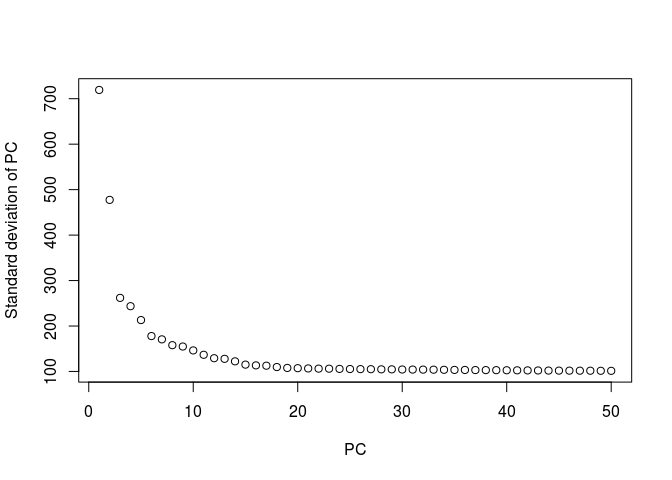

Based on the plot, we select 11 principal components for tSNE analysis. CellRouter includes helpful functions to visualize cell type annotations or clustering in the tSNE, PCA, or a customized dimensionality reduction technique. In case of a customized dimensionality reduction space, use the customSpace function
-------------------------------------------------------------------------------------------------------------------------------------------------------------------------------------------------------------------------------------------------------------------------------------------------------------------------

    cellrouter <- computeTSNE(cellrouter, num.pcs = 11, seed=42, max_iter = 1000)
    cellrouter <- customSpace(cellrouter, cellrouter@tsne$cell.embeddings) #where matrix is a data.frame with coordinates of cells in the space of reduced dimensionality.

    plotReducedDimension(cellrouter, reduction.type = 'tsne', dims.use = c(1,2), annotation = "celltype", annotation.color = 'celltype_color', showlabels = TRUE, 4.5, 3.5, filename='results/tSNE_1.pdf')

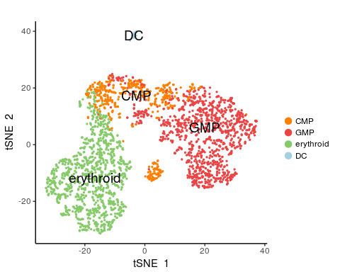

    plotReducedDimension(cellrouter, reduction.type = 'pca', dims.use = c(1,2), annotation = "celltype", annotation.color = 'celltype_color', showlabels = FALSE, 4.5, 3.5, filename='results/PCA_1.pdf')

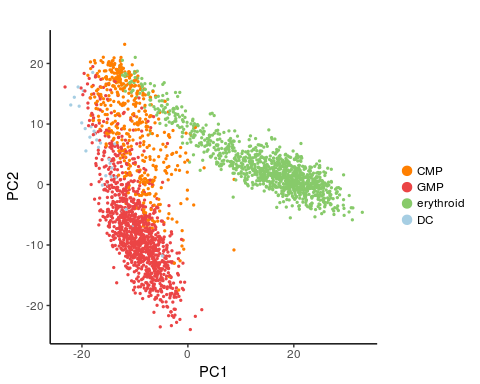

    plotReducedDimension(cellrouter, reduction.type = 'tsne', dims.use = c(1,2), annotation = "celltype2", annotation.color = 'celltype2_color', showlabels = TRUE, 4.5, 3.5, filename='results/tSNE_2.pdf')

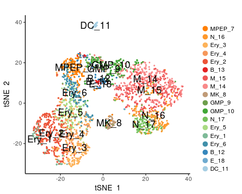

    plotReducedDimension(cellrouter, reduction.type = 'pca', dims.use = c(1,2), annotation = "celltype2", annotation.color = 'celltype2_color', showlabels = FALSE, 4.5, 3.5, filename='results/PCA_2.pdf')

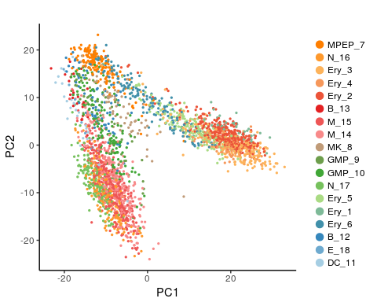

    plotReducedDimension(cellrouter, reduction.type = 'dr.custom', dims.use = c(1,2), annotation = "celltype2", annotation.color = 'celltype2_color', showlabels = FALSE, 4.5, 3.5, filename='results/custom_1.pdf')

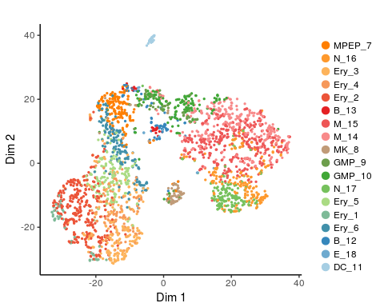

CellRouter includes helpful functions to perform differential expression analysis and idetify gene signatures based on annotations specified by the user. For example, below we perform a differential expression analysis between cell type annotations in the column "celltype" of the CellRouter metadata table (<cellrouter@sampTab>). The column "celltype" contains information for the broad populations: CMP, DC, Erythroid and GMP. It also allows to perform the differential test using any other column containing metadata. For example, we also identified gene signatures for clusters identified in the original study by Paul et al (column "celltype2"). Annotated heatmaps are also generated.
-----------------------------------------------------------------------------------------------------------------------------------------------------------------------------------------------------------------------------------------------------------------------------------------------------------------------------------------------------------------------------------------------------------------------------------------------------------------------------------------------------------------------------------------------------------------------------------------------------------------------------------------------------------------------------------------------------------------

    ### signatures based on sorted populations
    markers <- findSignatures(cellrouter, column = "celltype", pos.only = TRUE, fc.threshold = 0.5)

    ## Calculating fold changes... 
    ## [1] "discovering subpopulation-specific gene signatures"
    ## cluster  CMP 
    ## [1] 17
    ## cluster  GMP 
    ## [1] 184
    ## cluster  erythroid 
    ## [1] 504
    ## cluster  DC 
    ## [1] 132
    ## [1] "finding subpopulation markers"

    top10 <- markers %>% group_by(population) %>% top_n(10, fc)
    filename <- 'results/heatmap_top_10_genes_sorted_populations.png'
    plotSignaturesHeatmap(cellrouter, markers = top10, column.ann = 'celltype', column.color = 'celltype_color', threshold = 2, width = 7, height = 7, filename=filename)

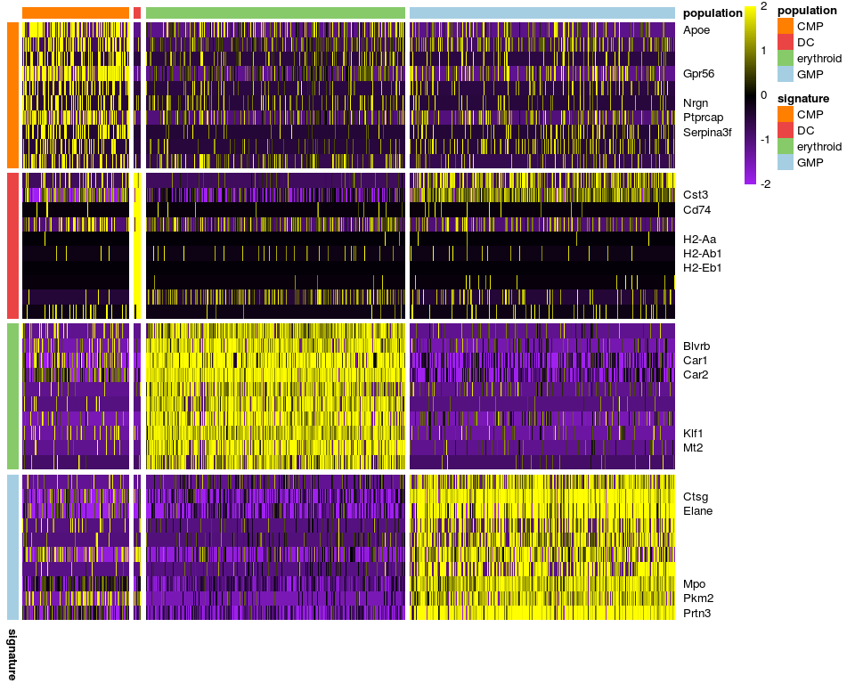

    ##            used  (Mb) gc trigger  (Mb) max used  (Mb)
    ## Ncells  1507707  80.6    2637877 140.9  2637877 140.9
    ## Vcells 44525522 339.8   84996754 648.5 84996675 648.5

    ### signatures based on clusters identified by Paul et al.
    markers <- findSignatures(cellrouter, column = "celltype2", pos.only = TRUE, fc.threshold = 0.5)

    ## Calculating fold changes... 
    ## [1] "discovering subpopulation-specific gene signatures"
    ## cluster  MPEP_7 
    ## [1] 23
    ## cluster  N_16 
    ## [1] 160
    ## cluster  Ery_3 
    ## [1] 502
    ## cluster  Ery_4 
    ## [1] 307
    ## cluster  Ery_2 
    ## [1] 415
    ## cluster  B_13 
    ## [1] 94
    ## cluster  M_15 
    ## [1] 126
    ## cluster  M_14 
    ## [1] 95
    ## cluster  MK_8 
    ## [1] 53
    ## cluster  GMP_9 
    ## [1] 42
    ## cluster  GMP_10 
    ## [1] 32
    ## cluster  N_17 
    ## [1] 160
    ## cluster  Ery_5 
    ## [1] 103
    ## cluster  Ery_1 
    ## [1] 446
    ## cluster  Ery_6 
    ## [1] 29
    ## cluster  B_12 
    ## [1] 42
    ## cluster  E_18 
    ## [1] 118
    ## cluster  DC_11 
    ## [1] 132
    ## [1] "finding subpopulation markers"

    top10 <- markers %>% group_by(population) %>% top_n(10, fc)
    filename <- 'results/heatmap_top_10_genes_original_clusters.png'
    plotSignaturesHeatmap(cellrouter, markers = top10, column.ann = 'celltype2', column.color = 'celltype2_color', num.cells = 100, threshold = 3, width = 15, height = 12, filename=filename)

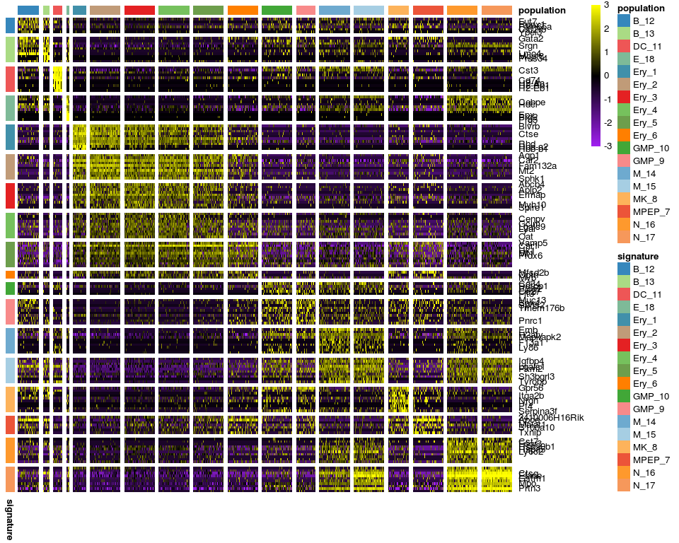

    ##            used  (Mb) gc trigger  (Mb)  max used  (Mb)
    ## Ncells  1538696  82.2    2637877 140.9   2637877 140.9
    ## Vcells 59375639 453.1  102076104 778.8 102076104 778.8

CellRouter provides a function to perform graph-based clustering and another to perform model-based clustering
--------------------------------------------------------------------------------------------------------------

    #Graph-based clustering
    cellrouter <- findClusters(cellrouter, method="graph.clustering", num.pcs=15, k=20)

    ## Graph-based clustering
    ## k:  20 
    ## similarity type:  jaccard 
    ## number of principal components:  15 
    ## [1] "building k-nearest neighbors graph"
    ## [1] "discoverying subpopulation structure"
    ## [1] "updating CellRouter object"

    plotReducedDimension(cellrouter, reduction.type = 'tsne', annotation="population", annotation.color = 'colors',showlabels = TRUE, width = 4.5, height = 3.5, filename='results/tSNE_graphClustering_clusters.pdf')

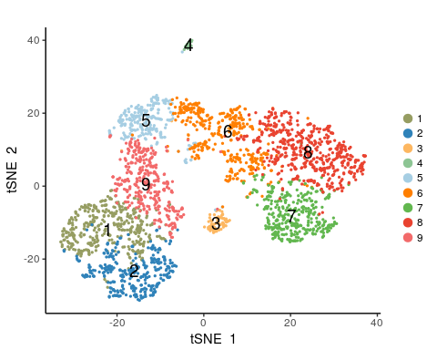

    #model-based clustering
    #cellrouter <- findClusters(cellrouter, method='model.clustering', num.pcs = 15)
    #plotReducedDimension(cellrouter, reduction.type = 'tsne', annotation="population", annotation.color = 'colors',showlabels = TRUE, width = 4.5, height = 3.5, filename='results/tSNE_modelClustering_clusters.pdf')

    ##Signatures based on clusters identified by CellRouter
    markers <- findSignatures(cellrouter, column = 'population', pos.only = TRUE, fc.threshold = 0.5)

    ## Calculating fold changes... 
    ## [1] "discovering subpopulation-specific gene signatures"
    ## cluster  1 
    ## [1] 423
    ## cluster  2 
    ## [1] 751
    ## cluster  3 
    ## [1] 59
    ## cluster  4 
    ## [1] 138
    ## cluster  5 
    ## [1] 14
    ## cluster  6 
    ## [1] 29
    ## cluster  7 
    ## [1] 161
    ## cluster  8 
    ## [1] 192
    ## cluster  9 
    ## [1] 40
    ## [1] "finding subpopulation markers"

    filename <- 'results/heatmap_all_genes_CellRouter_clusters.png' #select how many cells to plot as well!
    plotSignaturesHeatmap(cellrouter, markers, column.ann = 'population', column.color  = 'colors', num.cells=100, threshold =  2.5, width = 15, height = 13, filename = filename)

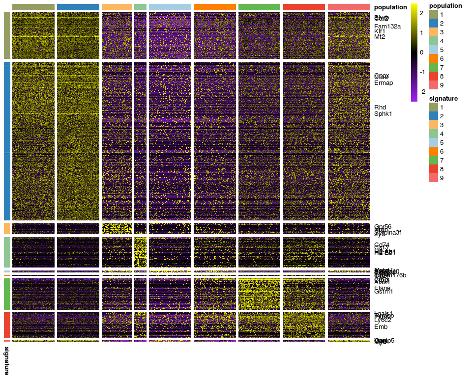

    ##            used  (Mb) gc trigger  (Mb)  max used  (Mb)
    ## Ncells  1610145  86.0    2637877 140.9   2637877 140.9
    ## Vcells 82627466 630.4  122571324 935.2 102076104 778.8

    top10 <- markers %>% group_by(population) %>% top_n(10, fc)
    filename <- 'results/heatmap_top_10_genes_CellRouter_clusters.png' #select how many cells to plot as well!
    plotSignaturesHeatmap(cellrouter, top10, column.ann = 'population', column.color  = 'colors', threshold =  2.5, width = 15, height = 13, filename = filename)

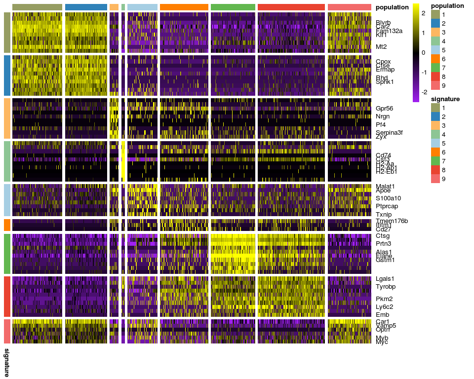

    ##             used   (Mb) gc trigger   (Mb)  max used   (Mb)
    ## Ncells   1640833   87.7    2637877  140.9   2637877  140.9
    ## Vcells 179657106 1370.7  256133216 1954.2 213375955 1628.0

Once we have identified cell populations, we can start the trajectory analysis using CellRouter. Once again, transitions between any cells states are possible. You can use your previously identified clusters, clusters identified by CellRouter or sorted populations to annotate the kNN graph that CellRouter uses to reconstruct single-cell trajectories. Below, we can build our kNN graph using clusters identified by Paul et al (column "celltype2") and identify trajectories between MPEP\_7 and GMP\_10, and the erythroid clusters (Ery\_1... Ery\_6) and the clusters GMP branch as N\_17 or N\_16. With CellRouter, transitions between any clusters can be identified. the plotKNN function plots the kNN graph using coordinates from a space of reduced dimensionality such as PCA, tSNE or custom.
-----------------------------------------------------------------------------------------------------------------------------------------------------------------------------------------------------------------------------------------------------------------------------------------------------------------------------------------------------------------------------------------------------------------------------------------------------------------------------------------------------------------------------------------------------------------------------------------------------------------------------------------------------------------------------------------------------------------------------------------------------------------------------------------------------------------------

Make sure if define libdir correctly by specifying:
---------------------------------------------------

    libdir <- '~/path/to/library/folder/CellRouter/'

    libdir <- '~/Documents/Projects/cellrouter-master/CellRouter/'
    #Trajectories can be identified between clusters identified by Paul et al using:
    cellrouter <- buildKNN(cellrouter, k = 10, column.ann = 'celltype2', num.pcs = 20, sim.type = 'jaccard')

    ## [1] "building k-nearest neighbors graph"
    ## [1] "updating CellRouter object"

    plotKNN(cellrouter, reduction.type = 'tsne', column.ann = 'celltype2', column.color = 'celltype2_color', width = 5, height = 4, filename='results/knn_tsne_original_clusters.pdf')

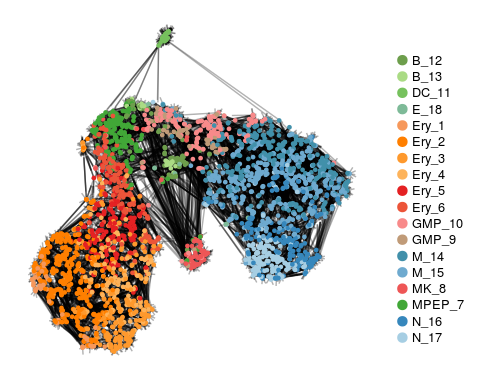

    plotReducedDimension(cellrouter, reduction.type = 'tsne', annotation="celltype2", annotation.color = 'celltype2_color',showlabels = TRUE, width = 4.5, height = 3.5, filename='results/tSNE_original_clusters.pdf')

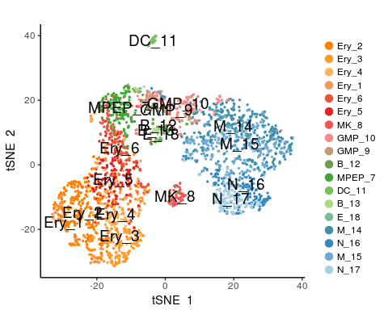

We will focus our trajectory analysis between clusters identified by CellRouter.
--------------------------------------------------------------------------------

    #Here, we will identify trajectories between clusters identified by CellRouter
    cellrouter <- buildKNN(cellrouter, k = 10, column.ann = 'population', num.pcs = 20, sim.type = 'jaccard')

    ## [1] "building k-nearest neighbors graph"
    ## [1] "updating CellRouter object"

    plotKNN(cellrouter, reduction.type = 'tsne', column.ann = 'population', column.color = 'colors', width = 5, height = 4, filename='results/knn_tsne_CellRouter_clusters.pdf') #increase legend size

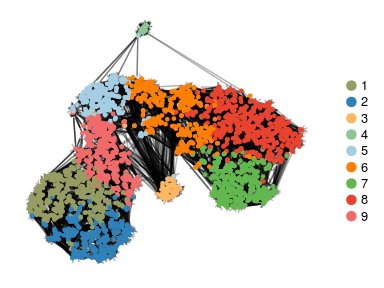

    plotReducedDimension(cellrouter, reduction.type = 'tsne', annotation="population", annotation.color = 'colors',showlabels = TRUE, width = 4.5, height = 3.5, filename='results/tSNE_graphClustering_clusters.pdf')

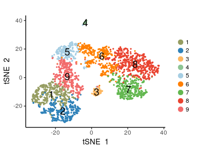

    filename <- "results/paths/cell_edge_weighted_network.txt"
    write.table(cellrouter@graph$edges, file=filename, sep='\t', row.names=FALSE, col.names = FALSE, quote=FALSE) #input network

    #Select population 6. Change sources and targets accordingly, depending on the annotation used (celltype, celltype2 or population, for example)
    sources <- c('6')
    targets <- setdiff(as.vector(cellrouter@sampTab$population), sources)
    methods <- c("euclidean", "maximum", "manhattan","canberra","binary", 'graph') #graph for distances in KNN

    ##Identify trajectories
    cellrouter <- findPaths(cellrouter, column='population', libdir, paste(getwd(), 'results/paths', sep='/'), method="graph")

    ## -------------------Transition: 6.1  -----------------------
    ## -------------------Transition: 6.2  -----------------------
    ## -------------------Transition: 6.3  -----------------------
    ## -------------------Transition: 6.4  -----------------------
    ## -------------------Transition: 6.5  -----------------------
    ## -------------------Transition: 6.7  -----------------------
    ## -------------------Transition: 6.8  -----------------------
    ## -------------------Transition: 6.9  -----------------------

    library(igraph)
    #Preprocess trajectories
    ranks <- c('path_cost', 'path_flow', 'rank', 'length')
    cellrouter <- processTrajectories(cellrouter, rownames(cellrouter@ndata), path.rank=ranks[3], num.cells = 3, neighs = 3,column.ann = 'population', column.color = 'colors')

    ## [1] "parsing trajectory information"
    ## Cells_FlowNetwork_all_paths_subnet.gml 
    ## Cells_FlowNetwork_all_paths_subnet.gml 
    ## Cells_FlowNetwork_all_paths_subnet.gml 
    ## Cells_FlowNetwork_all_paths_subnet.gml 
    ## Cells_FlowNetwork_all_paths_subnet.gml 
    ## Cells_FlowNetwork_all_paths_subnet.gml 
    ## Cells_FlowNetwork_all_paths_subnet.gml 
    ## [1] 3
    ## [1] "6.1"
    ## [1] "6.2"
    ## [1] "6.3"
    ## [1] "6.5"
    ## [1] "6.7"
    ## [1] "6.8"
    ## [1] "6.9"

    names <- unique(names(cellrouter@pathsinfo$distr))
    ##Identify genes regulated along each trajectory (up or down-regulated)
    cellrouter <- correlationPseudotime(cellrouter, type='spearman')

    ## [1] "computing correlation with the pseudotime"
    ## 6.1 
    ## 6.2 
    ## 6.3 
    ## 6.5 
    ## 6.7 
    ## 6.8 
    ## 6.9

    cellrouter <- topGenes(cellrouter, 0.8, 0.1)

Fit kinetic profiles to smoothen kinetic patterns and enhance clustering of complex transcriptional patterns, such as transient up or down-regulation
-----------------------------------------------------------------------------------------------------------------------------------------------------

    cellrouter <- smoothDynamics(cellrouter, names)
    cellrouter <- clusterGenesPseudotime(cellrouter, 5)
    save(cellrouter, file='results/CellRouter_Processed.R')

Create gene regulatory network
------------------------------

    #Create gene regulatory network
    grn.data <- buildGRN(cellrouter, species = 'Mm', genes.use = rownames(cellrouter@ndata), zscore = 5, filename = 'results/GRN.R')

Downstream analysis. Plot transcriptional clusters.
---------------------------------------------------

    #plot clusters of kinetic changes along trajectories
    plotClusterHeatmap(cellrouter, names, 10, 10, 2, 'results/dynamics.pdf')

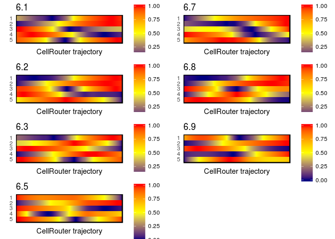

    #Transition from 6.2 in the enrythroid branch
    plotClusters(cellrouter, names[2], 2, 400, 450, 'results/cluster_dynamics.png')

    ## [1] 1

    ## [1] 2

    ## [1] 3

    ## [1] 4

    ## [1] 5

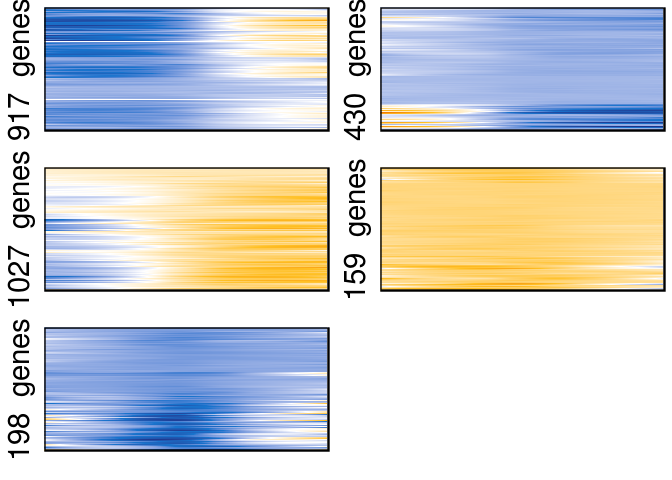

### Gene expression dynamics of selected genes in the erythroid branch. The object <cellrouter@top.correlations> contains genes that are highly correlated or anti-correlated with each trajectory

    #Erythroid branch (transition from cluster 6 to 2)
    genelist <- c('Gata2', 'Gata1', 'Car2', 'Klf1')
    plottrajectories(cellrouter, '6.2', genelist, rescale = TRUE, columns=1, width=5, height=2, filename='results/dynamics_curve.pdf')

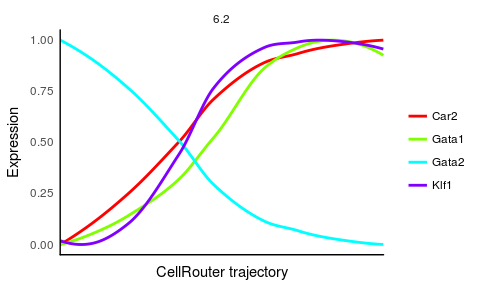

    plotPathHeatmap(cellrouter, c('6.2'), genelist, 2, 4, 2, 'results/')

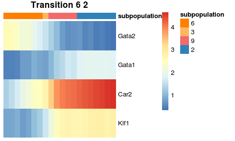

    plotDRExpression(cellrouter, genelist, reduction.type='tsne', columns = 4, width=6, height=3, filename='results/tsne_selected_genes_known_Ery.pdf')

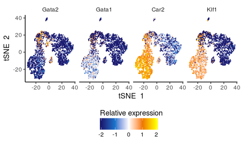

Gene expression dynamics of selected genes in the GMP branch.
-------------------------------------------------------------

    #GMP branch (transition from cluster 6 to 7)
    genelist <- c('Mpo', 'Elane', 'Ctsg', 'Ly6c2')
    plottrajectories(cellrouter, '6.7', genelist, rescale = TRUE, columns=1, width=5, height=2, filename='results/dynamics_curve.pdf')

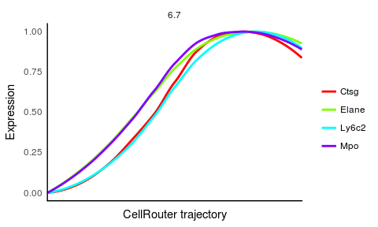

    plotPathHeatmap(cellrouter, c('6.7'), genelist, 2, 4, 2, 'results/')

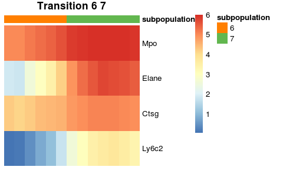

    plotDRExpression(cellrouter, genelist, reduction.type='tsne', columns = 4, width=6, height=3, filename='results/tsne_selected_genes_known_GMP.pdf')

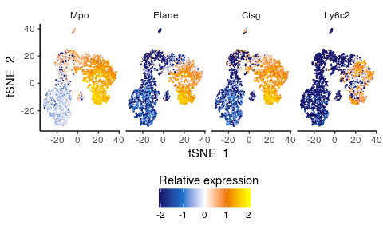

Branch-specific gene expression dynamics
----------------------------------------

    plotbranch(cellrouter, 'up','6.2', '6.7', 1, width=3, height=4, filename='results/6.2_6.7_branch_dynamics.png')

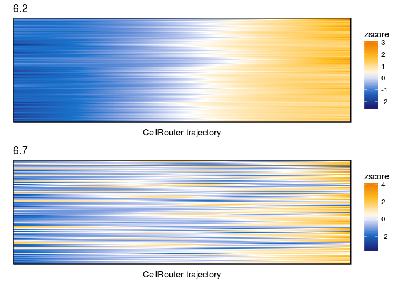

    plotbranch(cellrouter, 'up','6.7', '6.2', 1, width=3, height=4, filename='results/6.7_6.2_branch_dynamics.png')

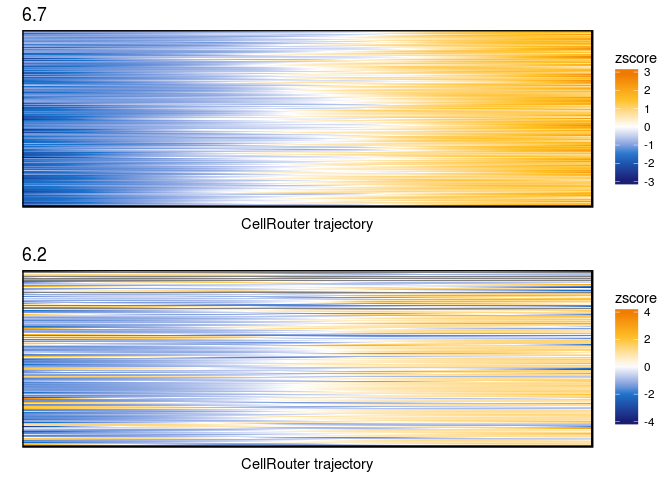

Integrate gene regulatory networks with gene expression dynamics along the trajectories to calculate a GRN score and identify putative regulators of these cell-fate transitions
--------------------------------------------------------------------------------------------------------------------------------------------------------------------------------

    grn.data <- get(load('results/GRN.R'))
    transitions <- c('6.1','6.2', '6.7', '6.8') #transitions to be analyzed
    grn.scores <- grnscores(cellrouter, ggrn = grn.data$GRN, tfs = grn.data$tfs, transitions = transitions, direction='both', flip=TRUE, q.up=0.75, q.down=0.25,
                   dir.targets='up', columns=2, width=5, height=7, filename='results/GRN_scores')

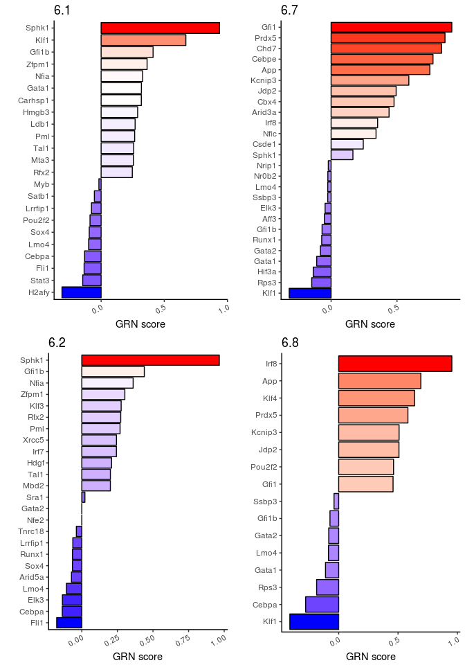

Plot dynamics and derivative plots of top transcriptional regulators based on the GRN score. Also plot subnetworks for selected transcriptional regulators in the erythroid branch.
-----------------------------------------------------------------------------------------------------------------------------------------------------------------------------------

    library('geomnet')
    p <- '6.2'
    plottr(cellrouter, p, grn.scores[[p]]$scores, cluster=FALSE, 2, 4.5, 5.5, paste('results/', p, 'Regulators_6.2_transition.pdf',sep=''))

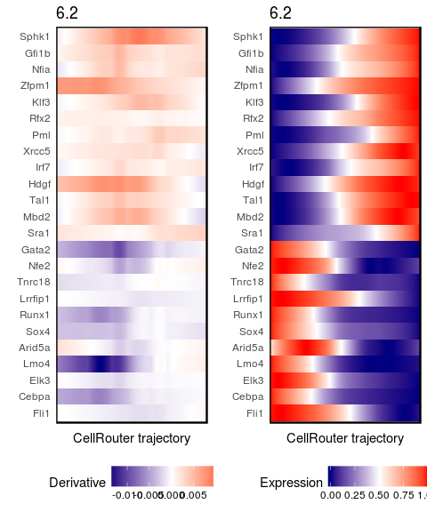

    regulators <- c('Sphk1','Klf1', 'Gfi1b')
    nets1 <- regulatornetwork(grn.scores, grn.data$GRN,regulators, 5, 2, 5, 9, 'results/regulator_networks_1.pdf')

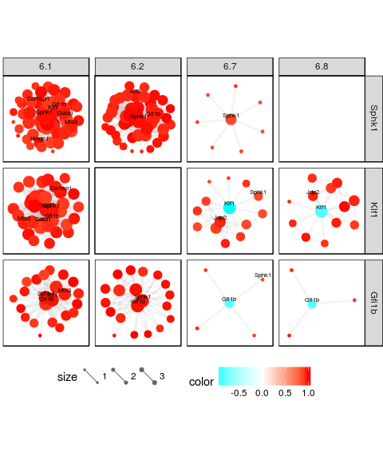

Plot dynamics and derivative plots of top transcriptional regulators based on the GRN score. Also plot subnetworks for selected transcriptional regulators in the GMP branch.
-----------------------------------------------------------------------------------------------------------------------------------------------------------------------------

    #dynamics of regulators along the transistion from cluster 6 to cluster 7 (GMP branch).
    p <- '6.7'
    plottr(cellrouter, p, grn.scores[[p]]$scores, cluster=FALSE, 2, 4.5, 5.5, paste('results/', p, 'Regulators_6.2_transition.pdf',sep=''))

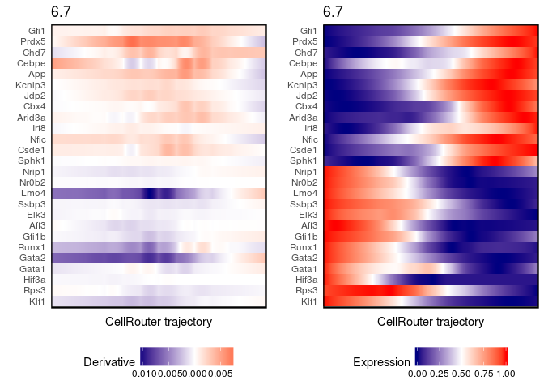

    regulators <- c('Gfi1', 'Cebpe', 'Prdx5')
    nets2 <- regulatornetwork(grn.scores, grn.data$GRN,regulators, 5, 2, 5, 9, 'results/regulator_networks_2.pdf')

