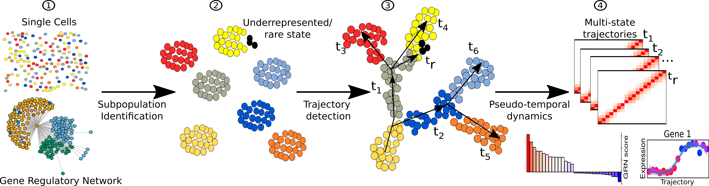

# CellRouter

### Introduction
CellRouter is a multifaceted single-cell analysis platform that identifies complex cell-state transition trajectories by using flow networks to explore the subpopulation structure of multi-dimensional, single-cell omics data. CellRouter integrates subpopulation identification, multi-state trajectories, and gene regulatory networks (GRNs) to provide new insights into cell-state transitions during lineage diversification, convergence, or cell reprogramming. For current tutorials illustrating how to use CellRouter, please take a look at the section [Examples](#example).

Overview of CellRouter. Step (1) Starting from single cells representing multiple cell states, including stable and in transition, a gene regulatory network is reconstructed to identify putative gene regulatory relationships. Step (2) Subpopulations are then identified by a combination of learning the structure of the data and community detection algorithms. Step (3) High-resolution multi-state trajectories are identified from any subpopulation to any other, including intermediate and mature cell types. Step (4) Multi-state trajectories illustrate the divergence of single-cell transcriptomes along each trajectory progression. Identification of genes implicated in the dynamic biological process under study, such as differentiation, and identification of regulators driving or mediating cell-fate transitions at the gene and network level.

### <a name="example">Examples</a>

### Citation
If you use CellRouter, please cite:

Edroaldo Lummertz da Rocha, R. Grant Rowe, Vanessa Lundin, Mohan Malleshaiah, Deepak Kumar Jha, Carlos R. Rambo, Hu Li , Trista E. North, James J. Collins & George Q. Daley. Reconstruction of complex single-cell trajectories using CellRouter. Nature Communications, 2018 (in press).
