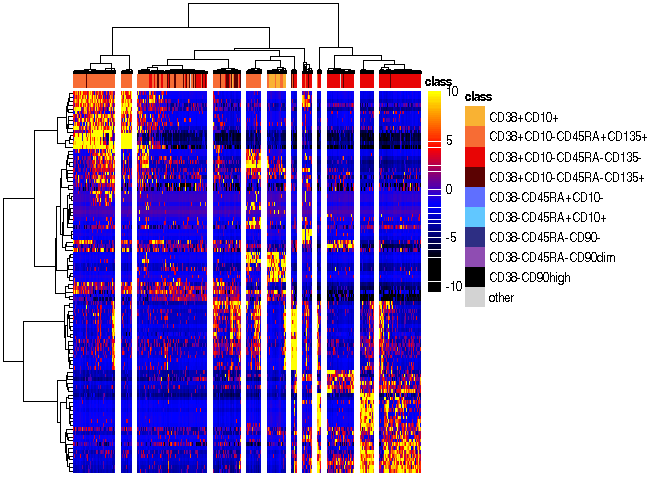
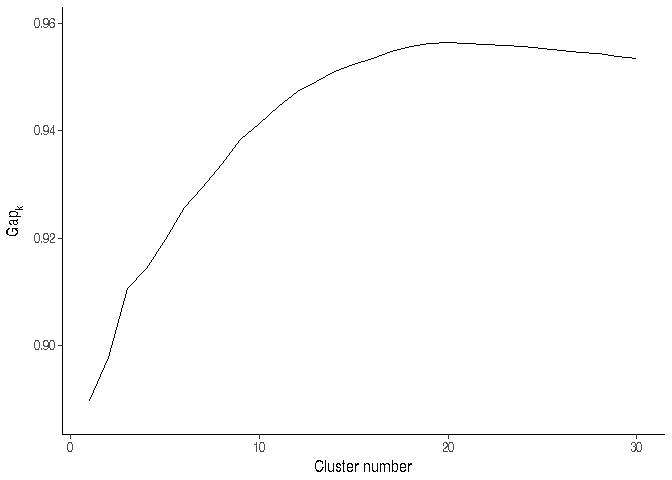
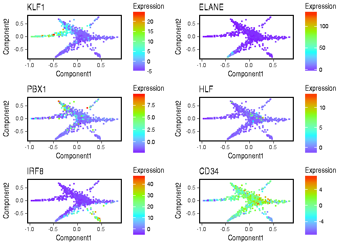
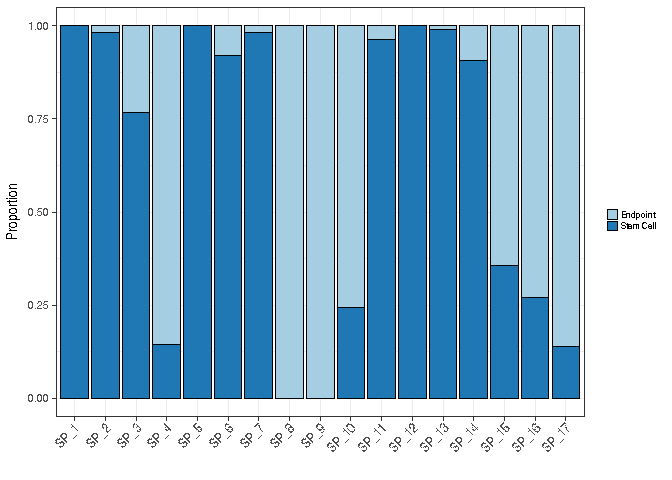
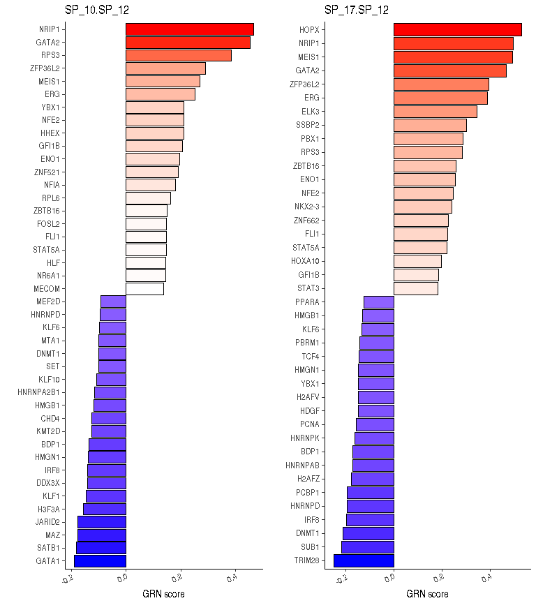
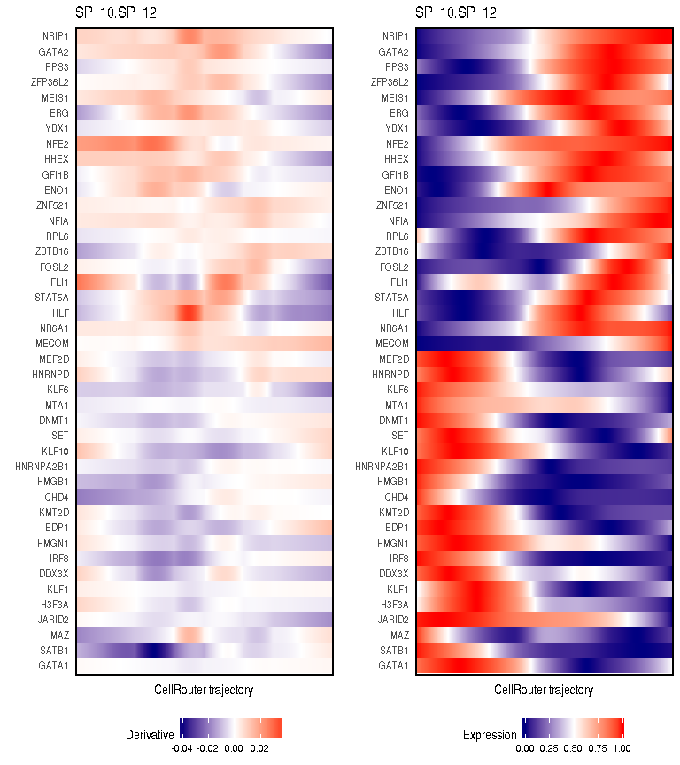
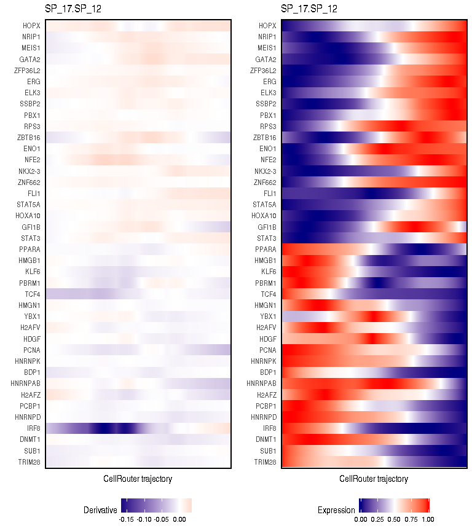
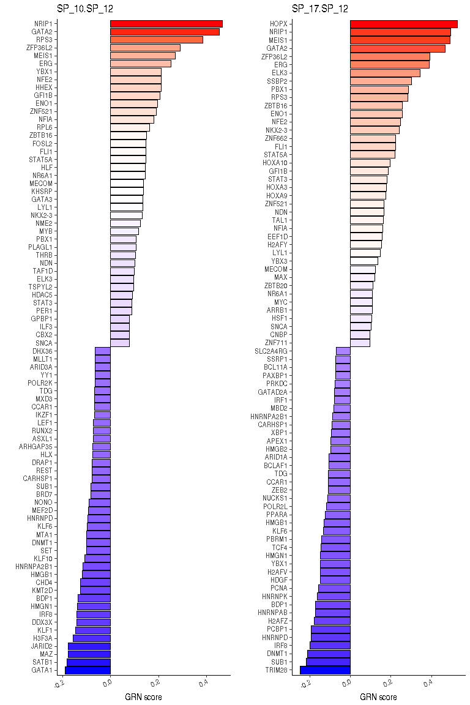
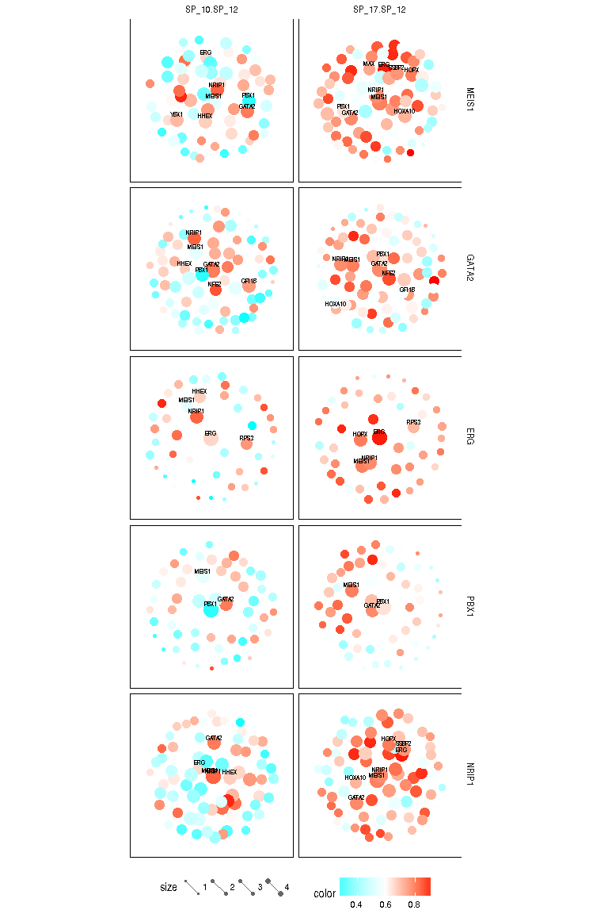
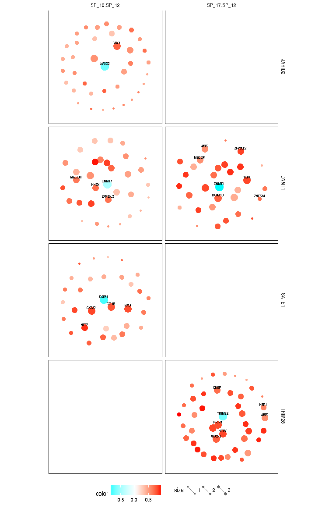

Reprogramming blood cell types
------------------------------

This tutorial describes how to apply CellRouter to a human single-cell
RNA-sequencing dataset generated by Velten et al. (Nature Cell Biology
2017). The analysis reported here reproduces the trajectory analysis
presented in Figure 5 of our manuscript (Lummertz da Rocha et al, Nature
Communications 2018). In your working directory, create a folder names
"results". Then, inside the folder results, create a folder named
"paths".

Install STEMNET
---------------

This tutorial requires that STEMNET is installed. Instructions to
install STEMNET can be found here: <https://git.embl.de/velten/STEMNET>.
Additional information to use STEMNET can be found here:
<https://git.embl.de/velten/STEMNET/blob/master/vignettes/VeltenHaasRaffel_Reproducible.Rmd>

Dimensionality reduction and cell type annotation using STEMNET
---------------------------------------------------------------

    source('../CellRouter_Class.R')
    libdir <- '../CellRouter/'

    library(DESeq2)
    require(STEMNET)
    require(ggplot2)
    require(cluster)
    require(pheatmap)

    cd38 <- populations[,"CD38+"]
    cd38minus_data <- geneExpression[!cd38,]
    cd38plus_data <- geneExpression[cd38,]

    vars_cd38plus <- apply(cd38plus_data, 2, var)
    vars_cd38plus <- vars_cd38plus[order(vars_cd38plus, decreasing=T)]
    vars_cd38minus <- apply(cd38minus_data, 2, var)
    vars_cd38minus <- vars_cd38minus[order(vars_cd38minus, decreasing=T)]

    colors <- c("CD38+CD10+" = "#F9B233",
                "CD38+CD10-CD45RA+CD135+" = "#F76C34",
                "CD38+CD10-CD45RA-CD135-" = "#E80505",
                "CD38+CD10-CD45RA-CD135+" = "#5B0202",
                "CD38-CD45RA+CD10-" = "#5F6FFF",
                "CD38-CD45RA+CD10+" = "#61C7FF",
                "CD38-CD45RA-CD90-" = "#2D2E83",
                "CD38-CD45RA-CD90dim" = "#8F4DB2",
                "CD38-CD90high" = "black",
                "other" = "lightgrey"
    )

    usepop <- names(colors)[-length(colors)]
    anno_df <- data.frame(class = booleanTable2Character(populations[cd38,usepop]), row.names=rownames(cd38plus_data))
    ann_colors = list(  class =colors )
    callback = function(hc, mat){
      sv = svd(t(mat))$v[,1]
      dend = reorder(as.dendrogram(hc), wts = sv)
      as.hclust(dend)
    }

    ddata <- t(cd38plus_data[,names(vars_cd38plus[1:100])])
    ddata[ddata>10] <- 10

    cd38plus_heatmap <- pheatmap(ddata, color = c(rep("black",15),colorRampPalette(c("black","blue","red","yellow"))(85)), cluster_rows = T, cluster_cols = T, clustering_distance_cols =dist(cd38plus_data[,names(vars_cd38plus[1:1000])]), clustering_distance_rows = "euclidean", annotation_col = anno_df,  annotation_colors=ann_colors, show_rownames=F,show_colnames=F, clustering_method="ward",clustering_callback=callback, cutree_cols = 12,fontsize_row=7)

    clusterfunction <- function(x, k) {
      d <- dist(x)
      dendro <- hclust(d, method="ward.D")
      list(cluster = cutree(dendro, k=k))
    }

    webfile <- get(load('gapstat.rda'))
    plf_gap <- data.frame(k = 1:30, gap = gap_cd38plus$Tab[,"gap"], sd = gap_cd38plus$Tab[,"SE.sim"], stringsAsFactors=T)
    gapplot <- ggplot2::qplot(x = k, y= gap, data=plf_gap, geom="line",size=I(0.5)) + ggplot2::theme_classic(base_size=12) + ggplot2::xlab("Cluster number") + ggplot2::geom_ribbon(aes(ymax = gap + sd, ymin=gap-sd), alpha=0.1, color = NA) + ggplot2::ylab(expression(Gap[k])) 
    print(gapplot)

    ncluster <- which.max(plf_gap$gap)
    cell_cluster <- cutree(cd38plus_heatmap$tree_col, k=ncluster)

    #create a data frame containing information on the populations
    pop <- cbind(all=T,do.call(cbind, lapply(1:max(cell_cluster), function(x) rep(F, length(cd38)))))

    pop[cd38,] <- cbind(all=T,do.call(cbind, lapply(1:max(cell_cluster), function(x) x == cell_cluster)))
    colnames(pop) <- c("all",paste0("HClust",1:ncluster))

    #manually merge small clusters of <=5 cells with the next bigger cluster:
    pop <- cbind(pop, HClust12_15_18_19_20 = apply(pop[,c("HClust12","HClust15","HClust18","HClust19", "HClust20")],1,any))
    pop <- pop[, !colnames(pop) %in% c("HClust12","HClust15","HClust18","HClust19", "HClust20")]

    colnames(pop) <- c("all","Im-2", "N-1", "Mono/D", "Im-1","ME-2", "N-0","sB-1","Mk", "N-2","ME-3","N-3","E-1","E-2", "G2M","sB-2","Eo/Baso")
    stemnet_pop <- data.frame(
      B = apply(pop[,c("sB-1","sB-2")],1,any),
      `Eo/Baso` = pop[,"Eo/Baso"],
      Erythroid = apply(pop[,c("E-1","E-2")],1,any),
      `Mono/D` = pop[,"Mono/D"],
      Mk =  pop[,"Mk"],
      Neutrophil = apply(pop[,c("N-1","N-2","N-3")],1,any)
    )
    stemnet_pop <- booleanTable2Character(stemnet_pop,other_value=NA)
    stemnet_result <- runSTEMNET(geneExpression, stemnet_pop)
    CAPframe <- plot(stemnet_result)

    plotdata <- CAPframe$PlotData
    stemcells <- plotdata[which(plotdata$class==TRUE),]
    endpoint <- plotdata[which(plotdata$class==FALSE),]

    m <- as.data.frame(CAPframe$PlotData[,1:2])
    colnames(m) <- c('tSNE1', 'tSNE2')
    nCounts <- as.data.frame(t(geneExpression))

    genes <- as.vector(unlist(lapply(strsplit(rownames(nCounts), split=" "), "[", 1)))
    geneTab <- data.frame(id=rownames(nCounts), symbol=as.vector(genes))
    nCounts <- averageIds(nCounts, geneTab, 'symbol')

Create CellRouter object
------------------------

    cellrouter <- CellRouter(expdata=as.data.frame(nCounts), annotations=colnames(nCounts))

    ## [1] "Initializing CellRouter object"

    cellrouter@rdimension <- as.data.frame(m)
    cellrouter <- findsubpopulations(cellrouter, 13, 'jaccard', 'results/kNN_network.gml')

    ## [1] "building k-nearest neighbors graph"
    ## [1] "discoverying subpopulation structure"
    ## [1] "plotting graph in RStudio"

    ## [1] "done plotting graph"
    ## [1] "updating CellRouter object"

    plotReducedDimension(cellrouter, 3.5, 3.5, filename='results/tSNE.pdf')

    cellrouter@sampTab$stemcell <- "Endpoint"
    cellrouter@sampTab[rownames(stemcells), 'stemcell'] <- 'Stem Cell'

    genelist <- c('KLF1', 'PBX1','IRF8', 'ELANE','HLF', 'CD34')
    plotDRExpression2(cellrouter, genelist, FALSE, 2, 5, 4, 'results/stemnet_populations.pdf')

    colors <- unique(cellrouter@sampTab$colors)
    names(colors) <- unique(cellrouter@sampTab$stemcell)

    data2 <- data.frame(cells=cellrouter@sampTab$stemcell, classification=cellrouter@sampTab$population)
    data2$classification <- factor(data2$classification, levels=unique(as.vector(data2$classification)))
    pdf(file='results/proportion.pdf', width = 4.7, height=2.5)
    g <- ggplot(data2,aes(x = classification, fill = cells)) + 
      geom_bar(position = "fill", color='black') + 
      theme_bw() + theme(legend.position='right', 
                         legend.key.size = unit(0.3, "cm"), 
                         legend.text=element_text(size=7)) + xlab("") + ylab("Proportion") + 
      theme(axis.text.x = element_text(size=10, angle=45, hjust=1), axis.title.y = element_text(size = rel(1), angle = 90)) + scale_fill_brewer("", palette = 'Paired')
    dev.off()

    ## PNG 
    ##   2

    plot(g)

    cellrouter <- createKNN(cellrouter, 10, 'jaccard', 'results/paths/kNN_network_trajectory.gml')

    ## [1] "updating CellRouter object"

    filename <- "results/paths/cell_edge_weighted_network.txt"
    write.table(cellrouter@graph$edges, file=filename, sep='\t', row.names=FALSE, col.names = FALSE, quote=FALSE) #input network

    #selecting starting subpopulation
    sources <- c('SP_8', 'SP_17', 'SP_10', 'SP_9', 'SP_15', 'SP_16')
    targets <- c('SP_12')
    methods <- c("euclidean", "maximum", "manhattan","canberra","binary", 'graph') 
    cellrouter <- findpaths(cellrouter, libdir, paste(getwd(), 'results/paths', sep='/'), method="graph")

    ## --------------------------: SP_8.SP_12 
    ## --------------------------: SP_17.SP_12 
    ## --------------------------: SP_10.SP_12 
    ## --------------------------: SP_9.SP_12 
    ## --------------------------: SP_15.SP_12 
    ## --------------------------: SP_16.SP_12

    ranks <- c('path_cost', 'path_flow', 'rank', 'length')
    genes2use <- rownames(cellrouter@ndata)
    cellrouter <- processtrajectories(cellrouter, genes2use, path.rank=ranks[3], num.cells = 3, neighs = 1)

    ## perform the analysis using all trajectories
    names <- unique(names(cellrouter@pathsinfo$distr))
    clusters.show <- names
    cellrouter <- correlationpseudotime(cellrouter, type='spearman')
    cellrouter <- topgenes(cellrouter, 0.85, 0.15)
    cellrouter <- smoothdynamics(cellrouter, names)
    cellrouter <- clusterGenesPseudotime(cellrouter, 5)
    save(cellrouter, file='results/CellRouter_HSPC_Processed.R')

    ggrn <- buildGRN('Hs', cellrouter@ndata, genes2use, 5, 'results/GRN.R')

    cellrouter <- get(load('results/CellRouter_HSPC_Processed.R'))
    tfs <- find_tfs(species = 'Hs')

    ## matching gene symbols and annotations

    ggrn <- get(load('results/GRN.R'))

    transitions <- c('SP_10.SP_12', 'SP_17.SP_12') #transitions to be analyzed
    x <- grnscores(cellrouter, tfs, transitions,
                   direction='both', flip=TRUE, q.up=0.95, q.down=0.05,
                   dir.targets='up', columns=2, width=5, height=5, 
                   filename='results/HSC_GRN_score')

    ## [1] 0
    ## [1] 0

    p <- transitions[[1]]
    m2 <- plottr(cellrouter, p, x[[p]]$scores, cluster=FALSE, 2, 4.5, 5.5, 
                 paste('results/', p, 'up_down_diff_dynamics_1.pdf',sep=''))

    p <- transitions[[2]]
    m2 <- plottr(cellrouter, p, x[[p]]$scores, cluster=FALSE, 2, 4.5, 5.5, 
                 paste('results/', p, 'up_down_diff_dynamics_2.pdf',sep=''))

    ### We repeat this analysis selecting more potential regulators to include PBX1 
    ## in both transitions in FIgure 5e
    ##load additional libraries
    library('ggnetwork')
    library('GGally')
    library('geomnet')
    library('network')
    library('sna')
    x <- grnscores(cellrouter, tfs, transitions,
                   direction='both', flip=TRUE, q.up=0.90, q.down=0.10,
                   dir.targets='up', columns=2, width=5, height=5, filename='results/HSC_GRN_score')

    ## [1] 0
    ## [1] 0

    regulators <- c('MEIS1', 'GATA2', 'ERG', 'PBX1', 'NRIP1')
    nets1 <- regulatornetwork(x, regulators, 5, 2, 5, 9, 'results/regulator_networks_1.pdf')

    regulators <- c('JARID2', 'DNMT1', 'SATB1', 'TRIM28')
    nets2 <- regulatornetwork(x, regulators, 5, 2, 5, 9, 'results/regulator_networks_down.pdf')

